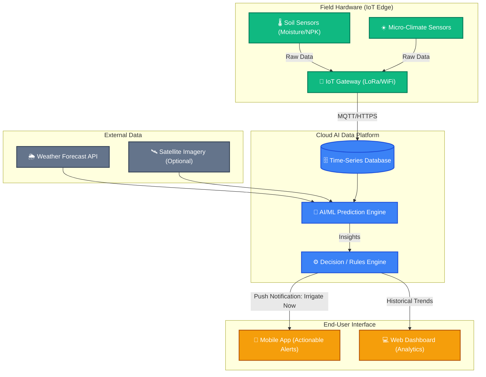

# Smart Agriculture AI/IoT: Project Pitch Materials

Based on the highly compelling problem statement, here are the accompanying materials to perfectly pitch your vision to hackathon judges, investors, or stakeholders.

## 1. Project One-Pager

**Project Name:** PrecisionAg (or KisanMitra)
**Tagline:** A precision agronomist in every farmer's pocket.

**The Problem (The Economic Hook):**
> *"By the time a farmer sees crop stress with their eyes, the yield loss is already 20-30% locked in."*

How might we build an adaptive AI + IoT system that learns from local conditions, predicts risks early, and stops this yield loss through hyper-local, data-driven decisions?

**The Solution:**
An end-to-end AI-powered IoT ecosystem that shifts the paradigm from *alerting the farmer* to **acting for the farmer.** By deploying low-cost IoT sensors and an advanced AI engine, the system doesn't just say "soil is dry" — it triggers the irrigation valve, adjusts the fertilizer schedule, and logs the action, creating a fully closed feedback loop.

**Three Layers of Originality:**
*   **Hyper-Local Sensing:** Placing sensor nodes per micro-zone (e.g., shaded vs. sun-exposed patches) because soil conditions vary dramatically within 50 meters.
*   **Predictive Yield Intelligence:** Instead of reactive dashboards, our AI models provide 2–3 week forward yield projections so farmers can plan for market and logistics, not just survive the current week.
*   **Zero-Tech-Barrier Access:** Removing the adoption barrier that kills 80% of ag-tech startups by building vernacular SMS alerts and a voice-first interface for rural access.

**Impact & Value Proposition:**
*   **For Farmers:** Reduced input costs (water/fertilizer), increased crop yield, and risk mitigation.
*   **For the Earth:** Sustainable resource management and lower chemical run-off.

---

## 2. Pitch Slide Structure (8-Slide Deck)

Use this flow for a 3-5 minute presentation or pitch.

*   **Slide 1: Title Slide**
    *   **Headline:** "A Precision Agronomist in Every Farmer's Pocket."
    *   **Visual:** High-quality, split-screen image (Left: traditional farming guessing; Right: modern farmer looking at a smart app).
*   **Slide 2: The Core Problem**
    *   **Headline:** Flying Blind in an Era of Climate Unpredictability.
    *   **Talking Point:** Global food demand is rising, yet farmers make decisions on intuition. Mention resource waste and yield loss as the primary consequences.
*   **Slide 3: Our Solution**
    *   **Headline:** Transforming Raw Data into Intelligent Action.
    *   **Visual:** The Solution Framework Diagram (see Section 3 below).
    *   **Talking Point:** An AI-powered IoT ecosystem that takes the guesswork out of farming.
*   **Slide 4: How It Works (The Tech)**
    *   **Headline:** From Soil to Screen.
    *   **Content:** 3 steps: 1. IoT Sensors collect. 2. AI Engine predicts. 3. Farmer App guides.
*   **Slide 5: Live Demo / Product Preview**
    *   **Headline:** Intuitive, Real-Time Dashboard.
    *   **Visual:** Screenshots of our React/Vite dashboard showing Moisture levels, Alerts, and NPK data.
*   **Slide 6: The Impact (Why it Matters)**
    *   **Headline:** Maximizing Yield, Minimizing Waste.
    *   **Key Stats:** Estimate a 30% reduction in water usage, 20% savings on fertilizer, and up to 15% yield increase.
*   **Slide 7: Uniqueness & Innovation (Our Edge)**
    *   **Headline:** Not Just Smart—Adaptive & Hyper-Local.
    *   **Content (Pick 3 max):**
        *   **🧠 Adaptive AI:** System learns from every harvest, getting smarter season by season.
        *   **🗣️ Voice-Assistant:** Farmers can just ask "Paani dena hai kya?" for local-language answers.
        *   **💧 Auto-Optimization:** AI doesn't just suggest—it can auto-trigger irrigation.
        *   **📱 Offline-First:** Core predictions work even without active rural internet.
*   **Slide 8: Target Market & Scalability**
    *   **Headline:** Built for Smallholders and Commercial Farms.
    *   **Content:** Mention affordability of IoT nodes and the scalable cloud AI infrastructure.
*   **Slide 9: Closing & Vision**
    *   **Headline:** Securing the Future of Global Farming.
    *   **Call to Action:** "Join us in bringing intelligence to every acre."

---

## 3. Solution Framework Visual (Architecture)

Below is the conceptual architecture of the system. You can screenshot this to use in your pitch deck.

